### Práctica 3 - Agustí López

**Crear directorios y archivos**
- Desde tu carpeta principal (~/), crea un directorio llamado GitApellido1Nombre2425.

```bash
mkdir GitLopezAgusti2425
```
- Dentro del directorio GitApellido1Nombre2425, crea una subcarpeta llamada src usando rutas relativas.
```bash
mkdir GitLopezAgusti2425/src
```
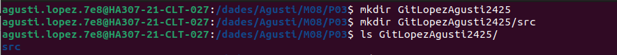
- Crea un archivo README.md en GitApellido1Nombre2425 con una breve descripción del proyecto, usa costantemente el terminal.
```bash
touch README.md
```
```bash
nano README.md
```

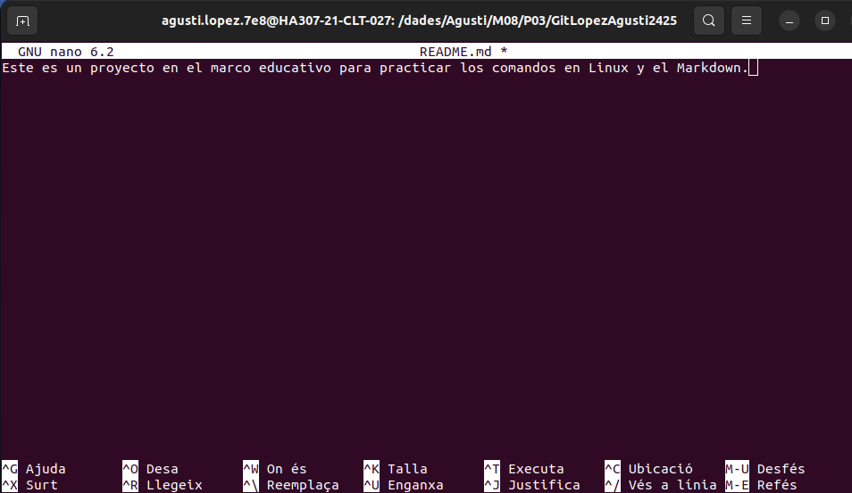

**Inicializa Git:**
- Entra en el directorio y conviértelo en un repositorio Git.
```bash
cd GitLopezAgusti2425
```
```bash
git init .
```
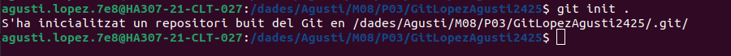
- Agrega un archivo .gitignore y configúralo para ignorar archivos de log y carpetas de configuración temporales.
```bash
touch .gitignore
```
```bash
nano .gitignore 
```
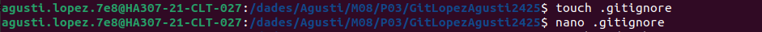
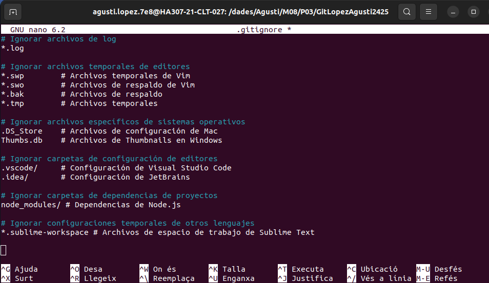
- ¿Qué es el archivo .gitignore y para que sirve?
- Crea una estructura básica de web index.html, style.css, main.js.
```bash
touch index.html style.css main.js
```
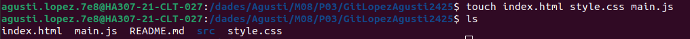
  

**Primera confirmación:**
- Haz un git add de todos los archivos y realiza un commit inicial con el mensaje: Inicio del proyecto con README.md y estructura básica.
```bash
git add .
```
```bash
git commit -m "Inicio del proyecto con README.md y estructura básica"
```
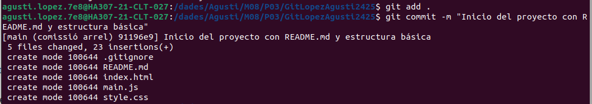

**Configura del repositorio remoto:**
- Entra en GitHub y crea un repositorio.
- ¿Qué pasa si creo un repositorio con el archivo README.md desde GitHub?
- ¿Qué pasa si crea un repositorio sin el archivo README.md desde GitHub?
- Explica las diferencias entre las 2 preguntas anteriores.
- Indica que comandos te da GitHub al crear un repositorio. Los encontrarás en el apartado …or create a new repository on the command line
```bash
echo "# prueba_m8" >> README.md
git init
git add README.md
git commit -m "first commit"
git branch -M main
git remote add origin https://github.com/agustilopz/prueba_m8.git
git push -u origin main
```

- Vincula el repositorio remoto con el repositorio local.
```bash
git remote add origin https://github.com/agustilopz/m08-p03.git
```
```bash
git push origin main
```
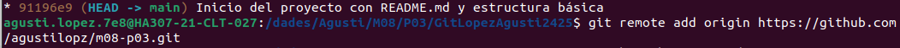
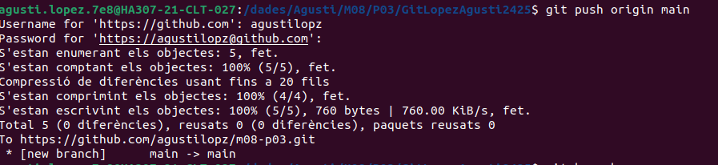
  
**Actualización del Proyecto:**
- Crea una nueva rama llamada feature/documentacion y cámbiate a ella.
```bash
git branch feature/documentacion
```
```bash
git checkout feature/documentacion 
```
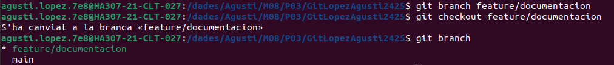
- Cambia a la nueva rama:
Crea un archivo docs.md en la carpeta raíz. Escribe un resumen de las funcionalidades del proyecto.
```bash
touch docs.md
nano docs.md
```
Haz un commit con el mensaje:
Agregada documentación inicial del proyecto.
```bash
git add docs.md
git commit -m "Agregada documentacion inicial del proyecto"
```
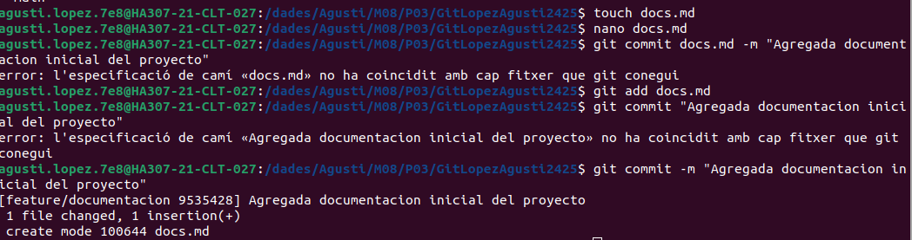
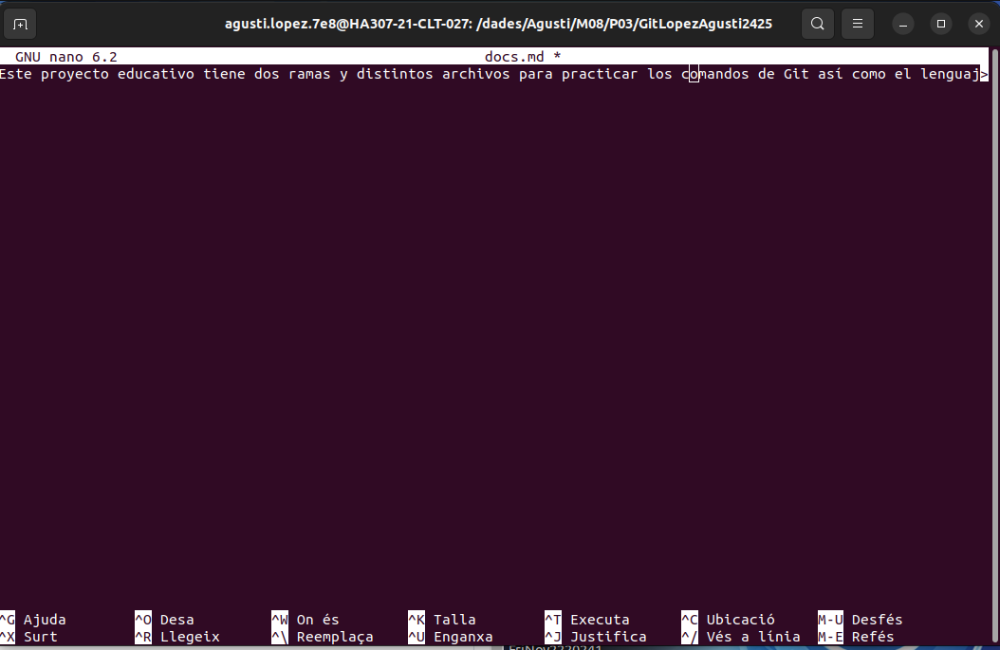
- Cambia a la rama main y usa git diff para comparar las diferencias entre main y feature/documentacion.
```bash
git checkout main
git diff main..feature/documentacion
```
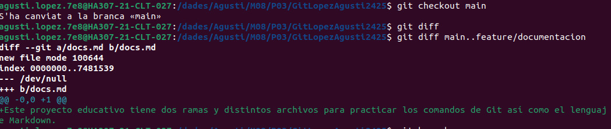

**Sincronización:**

- Desde la rama main, realiza un git pull para simular la descarga de cambios del remoto. Si hay conflictos, resuélvelos.
```bash
git pull origin main
```
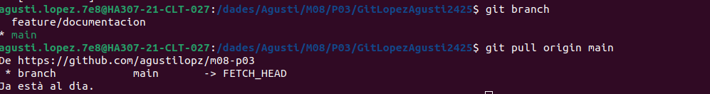

**Ediciones rápidas:**

- Crea un nuevo archivo llamado src/app.py con un mensaje básico (print("Hola, mundo!")).
```bash
cd src/
touch app.py
nano app.py
```
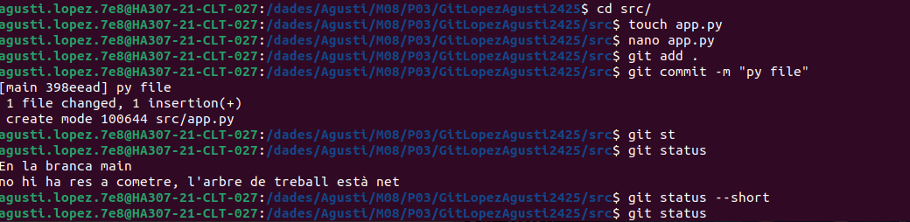
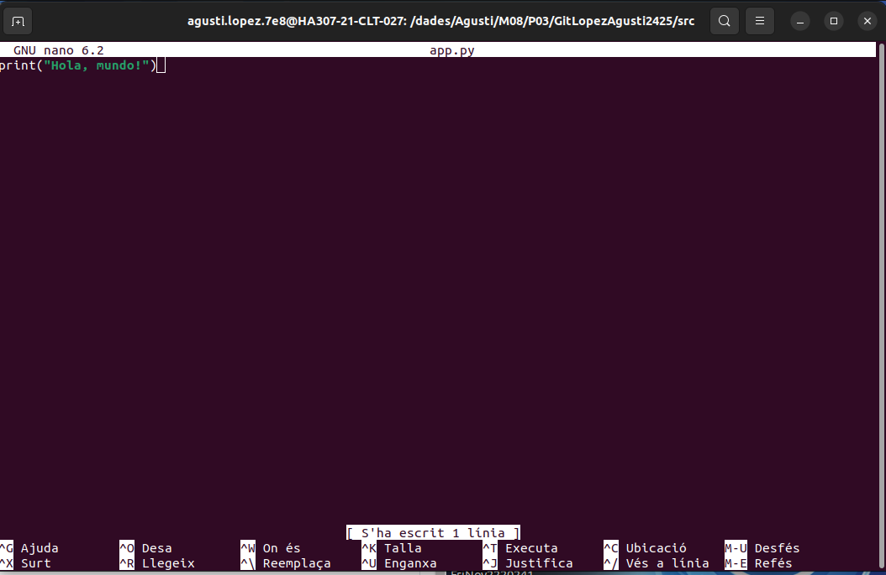
- Haz un add y luego un commit. Verifica su estado con  status o con algún comando alias que hayas creado tú.
```bash
git add .
git commit -m "py file"
```
- Visualiza el historial de commit con log o con algún comando alias que hayas creado tú.
```bash
git lg
```
- Si has utilizado comandos alias, indica el equivalente al comando alias. Por ejemplo, mi comando alias git s es igual al comando git status --short.
```bash
git log --oneline --decorate --all --graph
```

**Borrado y recuperación:**

- Borra el archivo src/app.py usando un comando de terminal. Recupera el archivo con el comando necesario, lo vimos la semana pasada.
```bash
git rm -r app.py
git checkout 398eead4b2a35d984a1662509532508523b3217e src/app.py
```
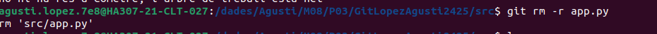
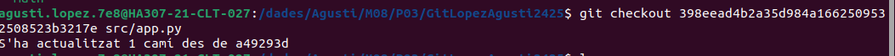
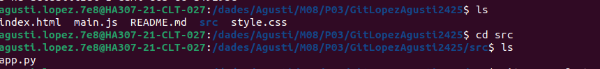

**Combina ramas:**
- Desde main, haz un merge de feature/documentacion.
```bash
git checkout main
git merge feature/documentacion
```

- Usa log o un alias para verificar los cambios realizados y el historial.
```bash
git lg
```
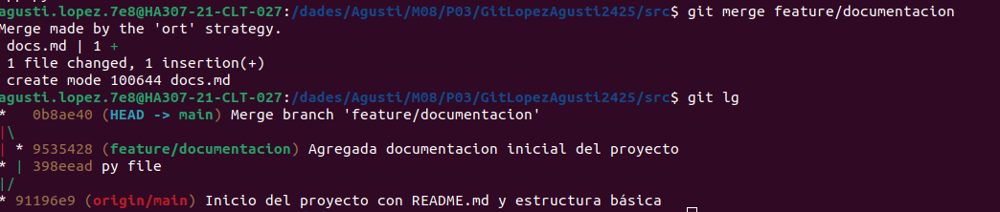


**Últimos pasos:**
- Asegúrate de que todos los archivos estén en su lugar y realiza un push final al remoto.
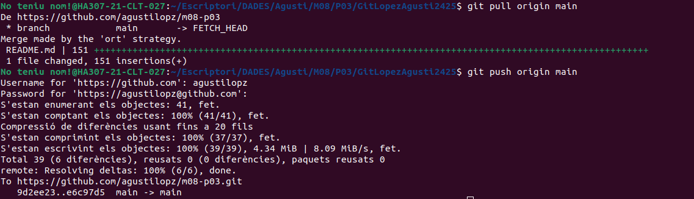
- Realiza una limpieza eliminando la rama feature/documentacion.

**Explora el proyecto desde el terminal:**

- Usa el comando necesario de Linux para listar el contenido de cada directorio.
- Muestra el contenido de los archivos finales con el comando necesario de Linux.


Este es un proyecto de ámbito académico para practicar los comandos de Linux así como el Markdown.
